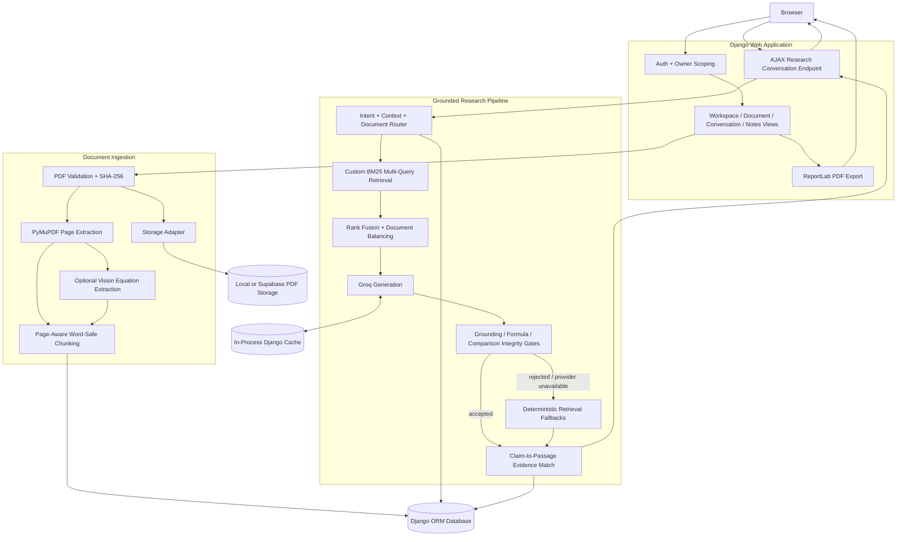
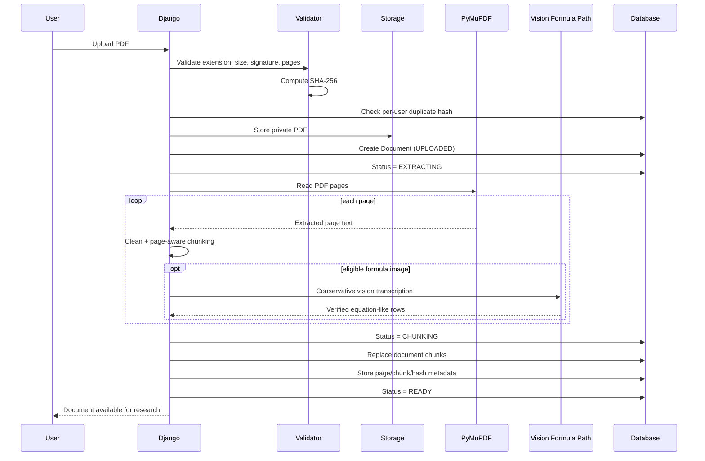
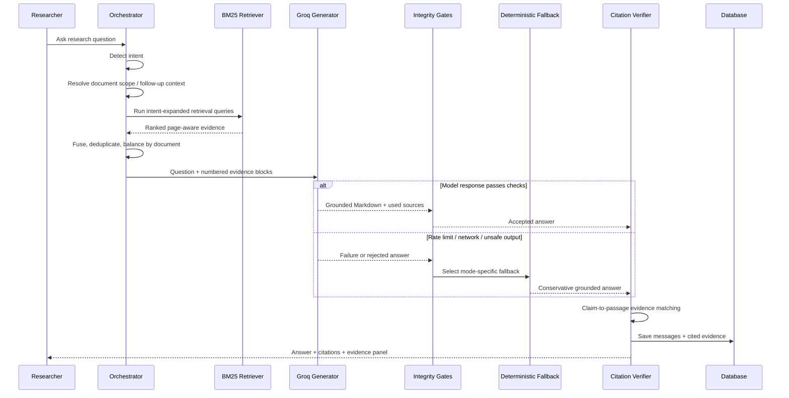
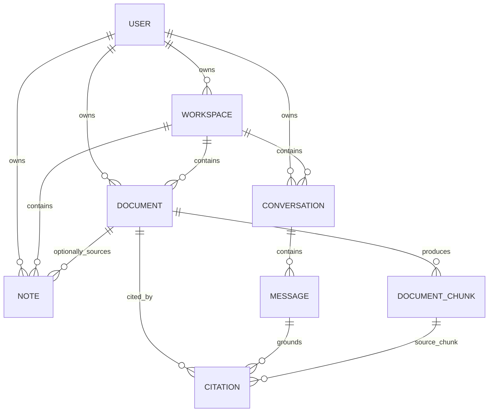

<div align="center">


### Evidence-grounded AI research workspace for academic PDFs

**Upload papers. Ask research questions. Inspect the evidence behind every grounded answer.**

[**Live App**](https://scholarsync-ph9x.onrender.com/) ·
[**Public Demo**](https://scholarsync-ph9x.onrender.com/demo/) ·
[**Create Account**](https://scholarsync-ph9x.onrender.com/accounts/register/)

</div>

---

## Table of Contents

- [What is ScholarSync?](#what-is-scholarsync)
- [Why it is more than "chat with PDF"](#why-it-is-more-than-chat-with-pdf)
- [Research workflow](#research-workflow)
- [Core capabilities](#core-capabilities)
- [System design](#system-design)
  - [High-level architecture](#high-level-architecture)
  - [PDF ingestion pipeline](#pdf-ingestion-pipeline)
  - [Grounded question-answering pipeline](#grounded-question-answering-pipeline)
  - [Data model](#data-model)
  - [Failure and fallback strategy](#failure-and-fallback-strategy)
- [Retrieval and grounding design](#retrieval-and-grounding-design)
- [Formula and mathematical-content handling](#formula-and-mathematical-content-handling)
- [Public demo](#public-demo)
- [Technology stack](#technology-stack)
- [Project structure](#project-structure)
- [Security and ownership boundaries](#security-and-ownership-boundaries)
- [Local development](#local-development)
- [Configuration](#configuration)
- [Testing](#testing)
- [Production deployment](#production-deployment)
- [Current engineering trade-offs](#current-engineering-trade-offs)
- [Roadmap](#roadmap)
- [Author](#author)

---

# What is ScholarSync?

ScholarSync is a Django-based research workspace for working with academic PDFs through an evidence-grounded retrieval-augmented generation pipeline.

A researcher can create a private workspace, upload papers, ask questions across one or more documents, compare papers, inspect page-level evidence, save research notes, work with formulas, and export a conversation as a structured PDF research report.

The core design principle is simple:

> **An answer is more useful when the researcher can inspect the evidence that supports it.**

ScholarSync therefore does not treat citations as decorative metadata. Retrieval results, document scope, cited passages, page numbers, and claim-to-passage evidence matching are part of the answer pipeline itself.

The application has two modes:

| Mode | Purpose |
|---|---|
| **Private workspace** | Authenticated research with user-uploaded PDFs, persistent conversations, citations, comparisons, and notes |
| **Public demo** | No-login experience using a fixed three-paper research library with packaged page-aware chunks |

---

# Why it is more than "chat with PDF"

A basic PDF chatbot often follows:

```text
PDF → chunks → retrieve → LLM → answer
```

ScholarSync adds control and verification around almost every stage:

```text
PDF
  ↓
validation + duplicate detection
  ↓
page-aware extraction
  ↓
word-safe chunking
  ↓
intent + document-scope routing
  ↓
multi-query BM25 retrieval
  ↓
document-balanced evidence selection
  ↓
grounded Groq generation
  ↓
output-integrity checks
  ↓
citation / claim evidence matching
  ↓
answer + evidence viewer + persistent conversation
  ↓
notes / comparisons / PDF report
```

Important engineering behaviors include:

- explicit document scoping when the user names a paper
- multi-document balancing for comparisons, summaries, tables, and formula requests
- refusal to silently substitute evidence from a different uploaded paper
- deterministic fallbacks when model generation is unavailable or fails grounding checks
- validation of citations before evidence cards are attached
- explicit comparison-integrity checks
- methodology-attribution safeguards
- formula-specific retrieval and output validation
- word-boundary-safe chunk overlap
- page-level source traceability
- persistent private research history
- no-login public demo with curated deterministic paths for flagship queries

---

# Research workflow

A typical private-workspace flow is:

```text
Create account
    ↓
Create workspace
    ↓
Upload one or more PDFs
    ↓
Validate + index documents
    ↓
Start a research conversation
    ↓
Ask a general, summary, table, comparison, or formula question
    ↓
ScholarSync scopes the relevant document(s)
    ↓
Retrieve page-aware evidence
    ↓
Generate and validate a grounded answer
    ↓
Inspect source passages and page links
    ↓
Save a note / compare papers / continue follow-up questions
    ↓
Export the conversation as a PDF report
```

---

# Core capabilities

## 1. Private research workspaces

ScholarSync uses Django authentication and owner-scoped data access.

Users can:

- register and log in
- create multiple workspaces
- upload and manage research PDFs
- start multiple conversations inside a workspace
- ask across the ready documents in that workspace
- access a dedicated research-notes area
- export conversations as PDF reports

Workspace, document, conversation, citation, and note records are tied back to the authenticated owner.

---

## 2. PDF validation and private storage

Before a document enters the research pipeline, ScholarSync validates:

- `.pdf` extension
- configured maximum upload size
- `%PDF-` file signature
- readability through PyMuPDF
- password protection
- non-zero page count
- configured maximum page count

A SHA-256 hash is generated during validation and used to prevent the same user from uploading a duplicate file.

Storage is abstracted behind two backends:

- **local private storage** for development
- **Supabase Storage** for production deployments

The production storage adapter talks to Supabase Storage from the Django server using authenticated HTTP requests. PDFs are not exposed through a public static-media route.

---

## 3. Page-aware PDF ingestion

Private PDFs are indexed synchronously after upload.

The pipeline:

1. marks the document as `EXTRACTING`
2. reads every page with PyMuPDF
3. cleans extraction artifacts conservatively
4. splits each page into overlapping research chunks
5. optionally inspects eligible equation images
6. stores page metadata and chunk hashes
7. marks the document as `READY`

Chunk records preserve:

- document
- workspace
- owner
- page number
- chunk index
- section heading field
- content
- content hash
- token-count estimate
- character offsets

The default chunker targets roughly `1450` characters with `180` characters of overlap.

Overlap is aligned to natural word boundaries and prefers a recent sentence boundary when possible, preventing a new chunk from starting halfway through a word.

A management command is also available to rebuild chunks for existing documents:

```bash
python manage.py reindex_documents
```

or for one document:

```bash
python manage.py reindex_documents --document-id <UUID>
```

---

## 4. Custom BM25 retrieval

The current deployed retrieval path is a **custom lexical BM25 implementation**.

It includes:

- token normalization
- lightweight singularization / aliases
- stop-word filtering
- BM25 scoring
- query-term coverage boosts
- 2-, 3-, and 4-token phrase boosts
- exact normalized-query boosts
- document-title boosts
- bibliography-heavy passage penalties

ScholarSync does **not** currently depend on LangChain, Chroma, or a production vector database for retrieval.

---

## 5. Intent-aware and document-aware retrieval

Before generation, ScholarSync routes questions into one of several modes:

- `general`
- `summary`
- `table`
- `comparison`
- `formula`

It also has deterministic routing for:

- greetings and acknowledgements
- capability questions
- document-inventory questions

For research questions, the orchestrator can resolve:

- explicitly named papers
- multiple named papers
- "all papers / all PDFs" requests
- terse follow-up questions
- the most recently referenced document when context is genuinely required

Explicit document names take priority over conversation history.

That prevents an older paper mentioned in the conversation from leaking into a later document-specific question.

---

## 6. Multi-query retrieval and fusion

One user question can be expanded into several intent-specific retrieval queries.

For example, a methodology question receives additional methodology/workflow search terms, while a formula question receives equation-oriented search terms.

Each query is searched independently with BM25. The results are then fused with a rank-based scoring strategy, intent-specific boosts, reference-section penalties, and near-duplicate suppression.

For multi-document tasks such as comparisons and summaries, ScholarSync retrieves **per document first** and then combines the evidence in a round-robin fashion.

This avoids a common multi-document RAG failure where one highly ranked paper consumes the entire context window and another requested paper disappears from the answer.

---

## 7. Grounded LLM generation

ScholarSync calls Groq through HTTPX using a configurable model.

Repository default:

```text
openai/gpt-oss-20b
```

The system prompt requires the model to:

- use only evidence supplied in the request
- avoid answering from model memory
- keep different papers, methods, countries, datasets, and concepts distinct
- cite factual claims using ScholarSync source numbers
- avoid inventing definitions, equations, values, or page numbers
- distinguish study methodology from methods merely mentioned in literature
- return clean Markdown and LaTeX
- state when the supplied evidence is insufficient

Structured responses use a schema with explicit `source_1`, `source_2`, ... boolean fields so bibliography numbers appearing inside a PDF cannot be mistaken for ScholarSync citation IDs.

---

## 8. Output-integrity gates

An LLM response is not accepted merely because the API returned `200 OK`.

ScholarSync checks different properties depending on the answer mode.

Examples include:

- invalid or missing ScholarSync citation numbers
- sufficient answers with no usable citations
- corrupted LaTeX
- formula answers that omit verified equations found in the supplied evidence
- fragile formula-table output
- malformed comparison tables
- inferred or cross-document limitations in comparisons
- uncited "key differences" between papers
- multi-document summaries that fail to represent every requested document
- methodology answers whose cited passages only describe background literature rather than the study's own applied method

When a response fails an integrity gate, ScholarSync retries when appropriate or moves to a conservative deterministic fallback.

---

## 9. Page-level citations and evidence viewer

Accepted private-workspace answers store citation records containing:

- citation number
- source document
- source chunk
- page number
- quoted passage
- retrieval score
- verification status

Only source numbers actually cited by the assistant answer are turned into evidence cards.

ScholarSync deliberately does **not** attach arbitrary top retrieval results to an uncited answer.

The UI shows the latest answer's evidence separately, with links that open the relevant PDF page.

---

## 10. Claim-to-passage evidence matching

ScholarSync includes a deterministic citation-verification layer.

It evaluates the local claim around a citation against the cited passage and returns labels such as:

- **Strong evidence match**
- **Partial evidence match**
- **Needs review**
- **Not checked**

The verifier uses lexical overlap and numeric consistency as a conservative **evidence-match signal**.

It is intentionally **not presented as a universal fact checker or truth guarantee**.

---

## 11. Grounded paper comparison

Users can select at least two ready PDFs and start a dedicated paper-comparison conversation.

The comparison pipeline is designed around a matrix containing:

- Objective
- Methodology
- Data / criteria
- Main findings
- Limitations

If the supplied evidence does not support a field, ScholarSync is instructed to say:

```text
Not explicitly stated in the supplied evidence
```

rather than infer a plausible answer.

Comparison-specific integrity checks also reject unsupported limitations and require optional "key differences" claims to cite evidence from the documents being contrasted.

A deterministic document-balanced comparison fallback is available when model synthesis cannot be accepted.

---

## 12. Research notes

ScholarSync has a dedicated notes workspace.

A note can contain:

- title
- content
- tags
- workspace
- optional source document
- optional source page

The form enforces ownership and source consistency—for example, a selected document must belong to the selected workspace, and a page number cannot exceed the document's page count.

### Save a chat answer as a note

ScholarSync also recognizes direct note actions such as:

```text
Save this as a note
Create this note
Add this to my notes
```

The note-action layer deterministically selects an earlier assistant research answer rather than asking the LLM to recreate it.

When possible, the generated note keeps the associated source document and cited page information.

---

## 13. Formula-aware research

Formula questions use a separate retrieval path.

ScholarSync can:

- scan the scoped document for equation-bearing chunks
- boost equation-related signals
- preserve page diversity
- pull neighboring formula/appendix chunks
- require formula answers to cover explicit named equations already present in the evidence
- normalize common PDF extraction artifacts without inventing missing mathematics
- fall back to explicit extracted equations if generation fails
- refuse to reconstruct unreadable equations from memory

Browser formulas are rendered with KaTeX.

---

## 14. Conservative vision-assisted equation extraction

Some research PDFs contain formula tables as embedded images rather than selectable text.

During indexing, ScholarSync can conservatively inspect sufficiently large page images on likely equation/formula/appendix pages using the configured Groq vision model.

Repository default:

```text
qwen/qwen3.6-27b
```

This is **not general-purpose OCR**.

The vision path is intentionally narrow:

- only eligible large images are considered
- the model is told to transcribe visible equations only
- unreadable expressions should be marked uncertain rather than reconstructed
- extracted rows must still look equation-like
- failures are non-fatal to normal PDF indexing

Accepted visual transcriptions become page-aware evidence chunks and are clearly marked as visual-equation extraction.

---

## 15. Conversation PDF reports

Private conversations can be exported with ReportLab.

The PDF renderer is designed as an academic evidence report rather than a raw chat transcript.

It supports:

- conversation metadata
- research question / answer content
- Markdown headings and lists
- comparison tables
- formula-safe rendering
- matrix / cases readability
- source evidence cards
- retrieval excerpts
- evidence-verification labels
- page numbers and branded headers / footers
- filename and identifier underscores without accidental Markdown corruption

The public demo reuses the same PDF rendering path through an in-memory adapter.

---

# System design

## High-level architecture



---

## PDF ingestion pipeline



Indexing currently happens synchronously in the upload request; the trade-off is documented later in this README.

---

## Grounded question-answering pipeline



---

## Data model

The persistent private-workspace model is intentionally simple and traceable:



### Main persisted entities

| Entity | Important fields |
|---|---|
| `Workspace` | owner, name, description, timestamps |
| `Document` | owner, workspace, filename/title, storage path, SHA-256, size, page count, processing status |
| `DocumentChunk` | document, workspace, owner, page, chunk index, content/hash, offsets |
| `Conversation` | owner, workspace, title, timestamps |
| `Message` | conversation, role, content, model, confidence, response time |
| `Citation` | message, chunk, document, page, quoted passage, retrieval score, verification status |
| `Note` | owner, workspace, optional document/page, title, content, tags |

`DocumentChunk` currently contains a JSON `embedding` field as future-facing scaffolding, but the live retrieval path does not use it.

---

## Failure and fallback strategy

ScholarSync is designed to degrade toward **grounded retrieval**, not toward hallucination.

| Failure / risk | Current behavior |
|---|---|
| No matching evidence | States that enough evidence was not found |
| Named document still processing | Refuses to answer from another paper |
| Groq `429` rate limit | Stops further model retries and moves to retrieval fallback |
| Transient `5xx` / network errors | Retries when appropriate, then falls back |
| Sufficient answer but no usable citations | Rejects or falls back |
| Multi-PDF summary omits a document | Uses document-balanced summary fallback |
| Methodology answer cites background-only method discussion | Uses conservative methodology fallback |
| Comparison infers unsupported limitations | Rejects model comparison and uses grounded matrix fallback |
| Formula answer omits explicit equations | Retries / falls back |
| Formula extraction visibly corrupted | Refuses to guess the missing mathematics |
| Visual equation extraction fails | Normal text indexing continues |
| Remote file deletion fails | Restores document state instead of silently deleting only the database row |

---

# Retrieval and grounding design

## Current retrieval: lexical by design

ScholarSync's runtime retriever is transparent and deterministic enough to inspect during development.

```text
Question
  ↓
intent detection
  ↓
context resolution
  ↓
document scoping
  ↓
intent-specific query expansion
  ↓
BM25 search per query
  ↓
rank fusion
  ↓
intent boosts / penalties
  ↓
near-duplicate suppression
  ↓
per-document balancing when needed
  ↓
numbered evidence blocks
```

This architecture makes it possible to reason about why a passage was retrieved and to write focused regression tests around retrieval failures.

A future vector/hybrid layer is intentionally treated as an evaluation problem, not as a prerequisite for calling the application "RAG."

---

## Conversation-context discipline

ScholarSync does not blindly prepend a long chat history to every retrieval request.

For follow-up resolution:

- only recent meaningful context is used
- explicit paper names in the current question win
- older document mentions should not override a standalone current question
- the most recently named document is used only for genuinely terse/referential follow-ups

For generation, prior messages are included only when the current question actually required context resolution.

This reduces cross-turn topic leakage.

---

## Evidence budgeting

For common private-workspace questions, source passages are bounded before they reach the model.

The highest-ranked evidence is preserved while keeping the prompt below a configured character budget in the generation code.

This helps control:

- token usage
- latency
- rate-limit pressure
- irrelevant context

---

## Caching

ScholarSync currently caches:

- accepted formula answers for an exact ordered evidence set
- accepted stable private `workspace-general` answers for an exact question/evidence set

Cache keys incorporate source identity/content hashes so a cached answer is not reused against changed evidence.

The default Django cache is `LocMemCache`, so this is currently an in-process optimization rather than a distributed caching architecture.

---

# Formula and mathematical-content handling

Research PDFs are difficult because mathematical expressions can be damaged at several stages:

```text
PDF layout
  → text extraction
  → retrieval
  → JSON serialization
  → model output
  → Markdown
  → KaTeX / ReportLab
```

ScholarSync therefore treats formulas as a dedicated subsystem rather than ordinary prose.

The implementation includes:

- equation-signal detection
- formula-specific query expansion
- document-wide equation scanning
- page-diverse formula retrieval
- neighboring formula/appendix evidence
- protection against JSON-damaged LaTeX commands
- syntax-only normalization for observed extraction/model artifacts
- completeness checks against explicit equations in the evidence
- deterministic formula fallback
- KaTeX browser rendering
- ReportLab-safe mathematical representation
- regression tests for LaTeX and PDF rendering

The system is deliberately conservative: it may normalize representation artifacts, but it should not invent a textbook equation simply because the paper mentions a known method.

---

# Public demo

The public demo is available at:

**https://scholarsync-ph9x.onrender.com/demo/**

It uses three packaged papers:

| Paper | Pages | Packaged chunks |
|---|---:|---:|
| *Effective Approaches to Attention-based Neural Machine Translation* | 11 | 55 |
| *Convolutional Sequence to Sequence Learning* | 15 | 75 |
| *Attention Is All You Need* | 11 | 36 |

The demo supports questions around:

- attention mechanisms
- global vs local attention
- ConvS2S
- Transformers
- neural sequence models
- comparison across the three papers
- explicit formulas from *Attention Is All You Need*

### Demo architecture

The demo is intentionally different from the private workspace:

- PDFs and chunks are packaged in `demo_data/`
- users do not upload files
- no `Conversation`, `Message`, or `Citation` database rows are created
- a generated demo ID is stored in the session
- recent demo history is kept in Django's cache for two hours
- history is bounded
- evidence cards are built only for citations actually present in the answer
- the latest assistant answer controls the right-hand evidence viewer

Two flagship demo routes use curated deterministic grounded answers:

- broad attention overview
- formula extraction

Other routes can use the same generation layer as the private workspace and fall back to curated output when the response becomes retrieval-only or its citations are detached from the claims.

---

# Technology stack

| Area | Technology / implementation |
|---|---|
| Language | Python 3.12 |
| Web framework | Django 5.2 |
| ORM | Django ORM |
| Local database | SQLite when `DATABASE_URL` is absent |
| Production database interface | PostgreSQL-compatible `DATABASE_URL` via `dj-database-url` + `psycopg` |
| PDF parsing | PyMuPDF |
| Retrieval | Custom BM25 lexical retrieval |
| Retrieval fusion | Multi-query rank fusion + document balancing |
| LLM | Groq Chat Completions API |
| Default generation model | `openai/gpt-oss-20b` |
| Default vision model | `qwen/qwen3.6-27b` |
| HTTP client | HTTPX |
| PDF reports | ReportLab |
| Production PDF object storage | Supabase Storage |
| Local PDF storage | Private filesystem backend |
| Frontend | Django Templates + custom JavaScript |
| Math in browser | KaTeX |
| CSS | Custom responsive editorial design system |
| Static serving | WhiteNoise |
| Cache | Django `LocMemCache` |
| Application server | Gunicorn |
| Deployment | Render |
| Tests | Django test runner + pytest / pytest-django available in development |
| Linting | Ruff |
| Container support | Docker |

---

# Project structure

```text
ScholarSync-Django/
│
├── apps/
│   ├── conversations/
│   │   ├── citation_verification.py   # claim-to-passage evidence matching
│   │   ├── models.py                  # Conversation, Message, Citation
│   │   ├── pdf_export.py              # academic evidence-report export
│   │   └── views.py                   # chat, comparison, persistence, export
│   │
│   ├── core/
│   │   ├── context_processors.py      # product / creator metadata
│   │   ├── forms.py                   # registration
│   │   └── views.py                   # homepage, registration, health
│   │
│   ├── demo/
│   │   ├── services.py                # demo retrieval/router/curated fallbacks
│   │   └── views.py                   # ephemeral history, evidence, PDF export
│   │
│   ├── documents/
│   │   ├── chunking.py                # page-aware word-safe chunking
│   │   ├── models.py                  # Document + DocumentChunk
│   │   ├── services.py                # indexing/re-index/delete reliability
│   │   ├── storage.py                 # local / Supabase storage adapters
│   │   ├── validators.py              # PDF validation + SHA-256
│   │   ├── visual_equations.py        # conservative image-equation extraction
│   │   └── management/commands/
│   │       └── reindex_documents.py
│   │
│   ├── notes/
│   │   ├── chat_actions.py            # save prior grounded answer as a note
│   │   ├── forms.py
│   │   ├── models.py
│   │   └── views.py
│   │
│   ├── rag/
│   │   ├── generator.py               # Groq prompts, validation gates, fallbacks
│   │   └── orchestrator.py            # intent, scope, retrieval orchestration
│   │
│   ├── retrieval/
│   │   └── lexical.py                 # custom BM25 implementation
│   │
│   └── workspaces/
│       ├── forms.py
│       ├── models.py
│       └── views.py
│
├── config/
│   ├── settings/
│   │   ├── base.py
│   │   ├── development.py
│   │   └── production.py
│   ├── urls.py
│   └── wsgi.py
│
├── demo_data/
│   ├── chunks.json
│   ├── documents.json
│   └── papers/
│
├── static/
│   ├── css/
│   │   ├── app.css
│   │   └── editorial.css
│   ├── images/
│   └── js/app.js
│
├── templates/
├── tests/
├── requirements/
│
├── .env.example
├── build.sh
├── Dockerfile
├── manage.py
├── pytest.ini
├── render.yaml
└── requirements.txt
```

---

# Security and ownership boundaries

ScholarSync is not presented as a formally audited security product, but the deployed architecture includes several important application-level controls.

## User ownership

Private routes use authenticated owner-scoped queries for workspaces, documents, conversations, and notes.

A user should not be able to select another user's workspace/document through form IDs because both view queries and forms are owner-scoped.

## Private files

Production PDFs are stored through the server-side Supabase storage adapter.

The Django application performs authenticated storage reads and returns the file through an authorized application route.

## Upload validation

Uploads are checked for:

- file type
- PDF signature
- parseability
- password protection
- size
- page count
- duplicate SHA-256

## Production Django settings

The production settings enable:

- `DEBUG = False`
- proxy-aware HTTPS handling
- HTTPS redirect by default
- secure session cookies
- secure CSRF cookies
- HSTS
- HSTS subdomains
- HSTS preload

Secrets such as the Django key, database URL, Groq key, and Supabase service-role key are environment variables and should never be committed to the repository.

---

# Local development

## 1. Clone

```bash
git clone https://github.com/thanos07/ScholarSync-Django.git
cd ScholarSync-Django
```

## 2. Create a virtual environment

### Windows PowerShell

```powershell
python -m venv .venv
.\.venv\Scripts\Activate.ps1
```

### macOS / Linux

```bash
python -m venv .venv
source .venv/bin/activate
```

## 3. Install development dependencies

```bash
pip install -r requirements/development.txt
```

## 4. Create `.env`

### Windows PowerShell

```powershell
Copy-Item .env.example .env
```

### macOS / Linux

```bash
cp .env.example .env
```

## 5. Configure local environment

A minimal local setup can keep:

```env
DJANGO_DEBUG=true
DJANGO_ALLOWED_HOSTS=localhost,127.0.0.1
DATABASE_URL=
DOCUMENT_STORAGE_BACKEND=local
```

Set a real local Django secret:

```env
DJANGO_SECRET_KEY=replace-this-with-a-local-secret
```

Add a Groq key to enable model-generated responses:

```env
GROQ_API_KEY=your-key
```

Without a usable generation path, ScholarSync has retrieval-based fallbacks for research answers.

## 6. Apply migrations

```bash
python manage.py migrate
```

## 7. Optional admin user

```bash
python manage.py createsuperuser
```

## 8. Start the server

```bash
python manage.py runserver
```

Open:

```text
http://127.0.0.1:8000/
```

### Useful routes

| Route | Purpose |
|---|---|
| `/` | Homepage |
| `/demo/` | Public demo |
| `/accounts/login/` | Login |
| `/accounts/register/` | Registration |
| `/app/` | Private workspaces |
| `/app/new/` | Create workspace |
| `/notes/` | Research notes |
| `/health/` | Health endpoint |
| `/admin/` | Django admin |

---

# Configuration

The committed `.env.example` exposes:

```env
DJANGO_SECRET_KEY=change-me
DJANGO_DEBUG=true
DJANGO_ALLOWED_HOSTS=localhost,127.0.0.1
DATABASE_URL=

GROQ_API_KEY=
GROQ_MODEL=openai/gpt-oss-20b
GROQ_VISION_MODEL=qwen/qwen3.6-27b

DOCUMENT_STORAGE_BACKEND=local
SUPABASE_URL=
SUPABASE_SERVICE_ROLE_KEY=
SUPABASE_STORAGE_BUCKET=research-pdfs

MAX_PDF_SIZE_MB=10
MAX_PDF_PAGES=75
MAX_DOCUMENTS_PER_USER=3
MAX_DAILY_QUESTIONS=15
```

## Runtime limits and quota configuration

Environment variables take precedence over the defaults committed to the repository.

| Setting | Repository / blueprint default | Runtime status in current `main` |
|---|---:|---|
| `MAX_PDF_SIZE_MB` | 10 MB | Enforced during PDF validation |
| `MAX_PDF_PAGES` | 75 pages | Enforced during PDF validation |
| `MAX_DOCUMENTS_PER_USER` | 3 documents | Enforced per authenticated user |
| `MAX_DAILY_QUESTIONS` | 15 | Configured, but not currently enforced in the question request path |

**Important:** the table reports the defaults committed to GitHub / `render.yaml`. A deployment platform can override them with environment variables without changing the repository, so this README does not claim an unverified live value for `MAX_DOCUMENTS_PER_USER`.

The document quota is checked **per user across workspaces**, not independently per workspace.

---

# Testing

Run Django system checks:

```bash
python manage.py check
```

Run the main test suite:

```bash
python manage.py test
```

The current released code was validated with:

```text
Found 138 test(s).
Ran 138 tests
OK
```

The repository contains regression coverage for areas including:

- permissions / owner scoping
- custom BM25 retrieval
- private RAG document scoping
- chunk overlap integrity
- document-delete reliability
- citation verification
- grounded-answer stability
- methodology retrieval/routing
- applied-method attribution
- section-aware fallbacks
- state-of-the-art routing
- workspace summary coverage
- workspace comparison generation
- workspace comparison integrity
- paper-comparison UI
- notes
- chat-driven note creation
- visual equation extraction
- formula LaTeX normalization
- PDF formula rendering

Development tooling also provides:

```bash
pytest
ruff check .
```

---

# Production deployment

ScholarSync is deployed on Render:

**https://scholarsync-ph9x.onrender.com/**

The committed Render blueprint uses:

```text
Runtime:        Python
Region:         Singapore
Plan:           Free
Branch:         main
Auto deploy:    on commit
Python:         3.12.8
Health check:   /health/
Storage:        Supabase
```

Build command:

```bash
./build.sh
```

`build.sh` performs:

```text
install production dependencies
→ collect static files
→ apply database migrations
```

Start command:

```bash
gunicorn config.wsgi:application \
  --workers 1 \
  --threads 2 \
  --timeout 180 \
  --bind 0.0.0.0:$PORT
```

The health endpoint returns:

```json
{
  "status": "ok",
  "service": "scholarsync"
}
```

A Dockerfile is also included with the same one-worker / two-thread Gunicorn shape for containerized deployment.

---

# Current engineering trade-offs

A strong system design should document not only what exists, but also what has intentionally **not** been abstracted away yet.

## 1. Retrieval is lexical, not vector/hybrid

The runtime path uses custom BM25 retrieval.

`DocumentChunk` contains a JSON `embedding` field as scaffolding, but production retrieval does not currently query embeddings or pgvector.

**Why this is acceptable now:** retrieval behavior remains transparent, inexpensive, and extensively testable.

**Next step:** benchmark hybrid retrieval against the current lexical baseline before adding infrastructure.

---

## 2. PDF indexing is synchronous

Upload currently performs extraction/chunking before the request completes.

**Advantage:** simple consistency model and fewer moving parts.

**Limitation:** large PDFs occupy a web worker longer than ideal.

**Scale path:** move ingestion to a background job queue when deployment resources justify it.

---

## 3. Cache is process-local

The default cache is Django `LocMemCache`.

**Advantage:** zero external cache dependency for the current single-worker deployment.

**Limitation:** cache state would not be shared across multiple application processes/instances.

**Scale path:** Redis or another shared cache when horizontal scaling is introduced.

---

## 4. Current Render process is intentionally small

The committed blueprint runs:

```text
1 Gunicorn worker × 2 threads
```

This is a resource-conscious configuration, not a claim of high-throughput architecture.

---

## 5. Public-demo history is ephemeral

Private conversations are persisted in the database.

Public-demo conversations are intentionally temporary and cache-backed.

This keeps the demo stateless from a product-data perspective but means demo history is not durable.

---

## 6. Citation verification is evidence matching, not truth verification

The current verifier can identify stronger/weaker local alignment between a claim and its cited passage.

It cannot establish that the underlying academic paper itself is correct.

That distinction is intentional in both the implementation and UI wording.

---

## 7. Vision extraction is narrow

The vision model is used as a conservative formula-transcription fallback for eligible embedded equation images.

ScholarSync does not currently run whole-document OCR.

---

# Roadmap

Future work is intentionally focused on **measurement, scalability, and retrieval quality**, rather than adding unrelated features.

### RAG evaluation

- build a versioned offline research-question benchmark
- measure Recall@K
- measure document-scope accuracy
- measure citation precision / evidence-match quality
- measure answer groundedness / faithfulness
- track latency and model cost

### Retrieval

- benchmark dense embeddings against current BM25
- evaluate BM25 + dense hybrid rank fusion
- add vector infrastructure only if the evaluation demonstrates a useful gain

### Asynchronous processing

- move PDF ingestion into background jobs
- add job progress / retry state
- isolate expensive vision transcription from request workers

### Observability

- structured request/retrieval/model metrics
- retrieval-quality diagnostics
- model-provider failure dashboards
- latency and token-usage tracking

### Scale

- shared cache
- multiple web workers / instances
- background worker tier
- load testing and capacity targets

### Research UX

- embedded PDF viewer
- citation-to-page highlighting
- richer source navigation

---

# Author

**Md Noor**

Portfolio: **https://portfolio-rosy-psi-74.vercel.app/**

GitHub repository: **https://github.com/thanos07/ScholarSync-Django**

---

<div align="center">

### ScholarSync

**Read. Ask. Cite.**

Built around one principle: research answers should remain inspectable back to their evidence.

</div>
